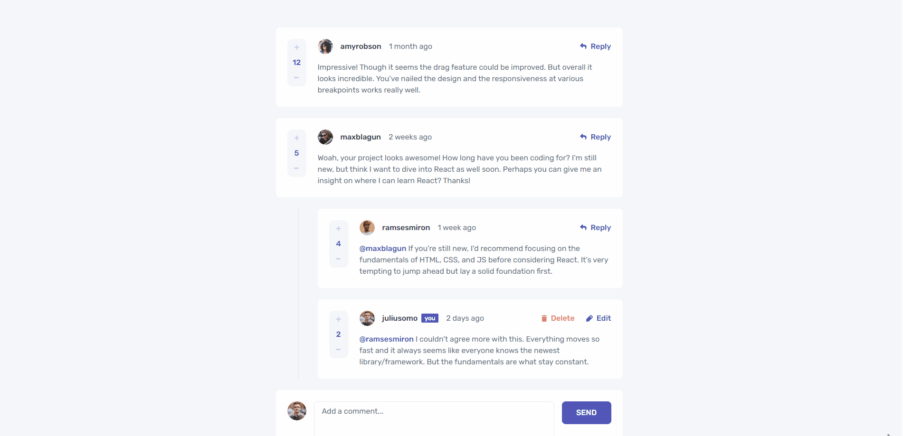

# Frontend Mentor - Interactive Comments Section Solution

This is my solution to the [Interactive Comments Section challenge on Frontend Mentor](https://www.frontendmentor.io/challenges/interactive-comments-section-iG1RugEG9).
I implemented the provided design and interactions with React, TypeScript, Tailwind CSS, and Vite, including the optional browser persistence feature.

## Table of contents

- [Overview](#overview)
  - [The challenge](#the-challenge)
  - [Screenshot](#screenshot)
  - [Links](#links)
- [My process](#my-process)
  - [Built with](#built-with)
  - [How I built it](#how-i-built-it)
  - [What I learned](#what-i-learned)
- [Running locally](#running-locally)
- [Author](#author)

## Overview

### The challenge

Users should be able to:

- View comments and replies in a responsive layout for mobile and desktop.
- Create comments and reply to other users' comments or replies.
- Edit and delete their own comments and replies, with confirmation before deletion.
- Upvote and downvote comments and replies, with scores staying at zero or above.
- See hover and keyboard focus states on interactive controls.

**Bonus implemented:** comments, replies, and scores persist after refreshing through `localStorage`.

The app uses the current user provided in the challenge's JSON data.

### Screenshot



### Links

- Solution URL: [View solution on Frontend Mentor](https://www.frontendmentor.io/solutions/interactive-comments-section-with-react-and-typescript-ypMc9Vqa9L)
- Live Site URL: [View live project](https://interactive-comments-section-main-beryl.vercel.app/)
- GitHub repository: [GitHub repository](https://github.com/israel-monteiro/interactive-comments-section-main)

## My process

### Built with

- Semantic HTML5 markup
- React and TypeScript
- Vite
- Tailwind CSS and CSS custom properties
- Flexbox and CSS Grid
- Mobile-first workflow
- React Context API
- `localStorage`

### How I built it

I divided the interface into comment cards, replies, forms, voting controls, and a delete dialog. I reused `AddComment`, `CommentActions`, and `VoteComment` across comments and replies, with TypeScript interfaces defining the data and props each component needs.

I kept the shared comment data and update functions in `CommentProvider`, exposed through `CommentContext`. Form inputs and the visibility of edit forms, reply forms, and the delete dialog use local component state.

I used immutable updates to add, edit, delete, and vote on comments and their nested replies. The provider reads saved comments from `localStorage` on initialization, falls back to the challenge's JSON data, and saves changes with `useEffect`.

I followed a mobile-first approach with Tailwind, combining CSS Grid for the comment layout and Flexbox for smaller groups of controls. The `md:` breakpoint rearranges voting controls, actions, and forms to match the desktop reference supplied by Frontend Mentor.

### What I learned

Reusing components helped me practice separating responsibilities and deciding which values to pass as props. Defining interfaces for comments, replies, and component props made those relationships clearer, especially because replies share comment fields but also need a `replyingTo` value.

I gained a better understanding of local versus shared state: opening one edit form belongs to that component, while updating its comment needs to reach the rest of the interface through Context. Working with nested replies also gave me practice combining `map`, `filter`, and spread syntax without changing the existing state directly.

For example, this update from `CommentProvider` removes a comment or a reply by ID while creating new arrays:

```tsx
setComments((prevComments) =>
    prevComments
        .filter((comment) => comment.id !== commentId)
        .map((comment) => ({
            ...comment,
            replies: comment.replies.filter((reply) => reply.id !== commentId),
        })),
);
```

Connecting state to `localStorage` helped me understand how initialization and effects work together to preserve changes after a refresh. Recreating the mobile and desktop layouts gave me more practice with responsive positioning, spacing, and Tailwind breakpoints.

I also practiced basic accessibility through semantic elements, accessible labels, visible keyboard focus, and a native `<dialog>` with Escape-to-close support for delete confirmation.

## Running locally

With Node.js and npm installed, run:

```bash
git clone https://github.com/israel-monteiro/interactive-comments-section-main.git
cd interactive-comments-section-main
npm install
npm run dev
```

Open the local URL printed in the terminal. Use `npm run build` to run TypeScript checks and generate the production build, or `npm run lint` to check the code with ESLint.

## Author

- Israel Monteiro
- GitHub: [@israel-monteiro](https://github.com/israel-monteiro)
